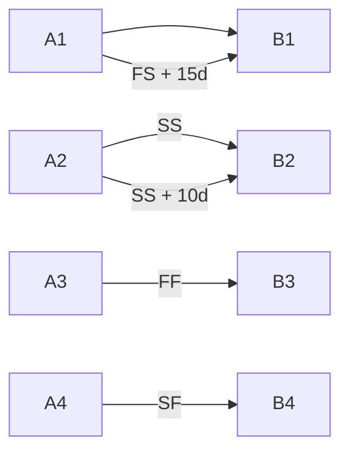
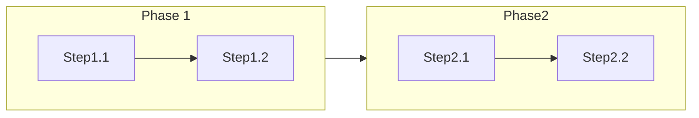

# Project schedule network diagrams

```mermaid
flowchart LR;
    A1 --> B1
    A1 --> |FS + 15d| B1
    A2 --> |SS| B2
    A2 --> |SS + 10d| B2
    A3 --> |FF| B3
    A4 --> |SF| B4
```

```mermaid
flowchart LR;
    subgraph Phase1 [Phase 1];
        direction LR
        Step1.1 --> Step1.2;
    end
    subgraph Phase2;
        direction LR
        Step2.1 --> Step2.2;
    end
    Phase1 --> Phase2;
```
