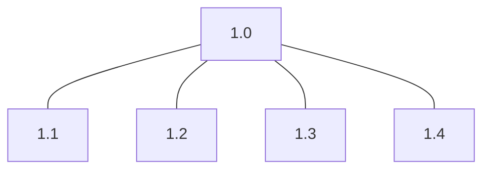
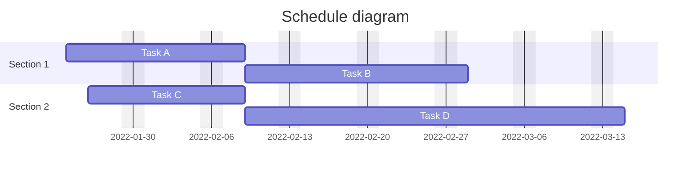

# Baselines

## Contents

- [Scope baseline](#scope-baseline)
- [Schedule baseline](#schedule-baseline)
- [Cost baseline](#cost-baseline)

## Scope baseline

"The approved version of a scope statement, work breakdown structure (WBS), and
its associated WBS dictionary, which is used as a basis for comparison."
[[1]](../home.md#references)

- Project scope statement
- WBS
- Work package
- Planning package
- WBS dictionary

### Work breakdown structure (WBS)

```ascii
            +-----+
            | 1.0 |
            +-----+
               |
   +-------+---+---+-------+
   |       |       |       |
+-----+ +-----+ +-----+ +-----+
| 1.1 | | 1.2 | | 1.3 | | 1.4 |
+-----+ +-----+ +-----+ +-----+
```



## Schedule baseline

"The approved version of the schedule model that is used as a basis for
comparison to the actual results." [[1]](../home.md#references)

- Documentation of the basis of the estimate
- Documentation of all assumptions made
- Documentation of any known constraints
- Indication of the range of possible estimates
- Indication of the confidence level of the final estimate
- Documentation of individual project risks influencing this estimate

```ascii
Section 1 | Task A    |
                      | Task B      |

Section 2   | Task C  |
                      | Task D                |
```



## Cost baseline

"The approved version of the time-phased project budget that is used as a basis
for comparison to the actual results." [[1]](../home.md#references)
